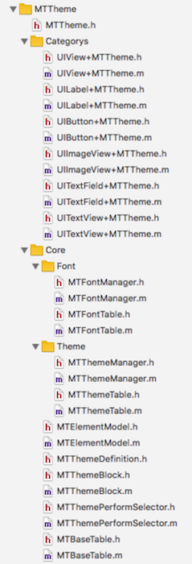

MTTheme
---------
## 目录

* [简述](#简述)
  * [模块功能](#本模块功能)
  * [效果图](#效果图)
* [设计结构](#设计结构)
  * [文件结构](#文件结构)
  * [类图结构](#类图结构)
* [使用方式](#使用方式)
* [加载性能评测](#加载性能评测)
* [优化](#优化)
* [后续优化](#后续优化)
* [结语](#结语)
  
## 简述
主题皮肤和字体内容的动态切换方案
### 模块功能
* 通过 `MTThemeManager` 设置主题路径，可以动态的进行主题切换
* 通过 `MTFontManager` 设置文字路径，可以动态的进行文字的切换, 类似国际化

### 效果图

## 设计结构
### 文件结构


*  `Categorys`文件夹下的类是颜色、图片、内容赋值时所需的分类。
*  `Core` 文件夹下 `Font` 放了字体内容管理类，`Theme` 放了主题内容的管理类


### 类图结构


> `MTFontManager` :

* 设置文字路径并解析 `font.plist`
* 通过 `addView:identifier:extendObj:selector:type:moduleName` 注册视图，当字体变化时，重新设置已经注册的视图的字体内容
* 通过 `getTextWithModuleName:identifier:` 获取对应的字体内容

> `MTThemeManager ` :

* 设置主题路径并解析 `color.plist` 和图片列表
* 通过 `addView:identifier:extendObj:selector:type:moduleName` 注册视图，当主题变化时，重新设置已经注册的视图的图片和颜色
* 通过 `getColorWithModuleName:identifier:` 获取对应的颜色值
* 通过 `getImageWithModuleName:identifier:` 获取对应的图片

> `MTFontTable` : 

* 管理 `MTElementModel` 列表，并刷新字体内容列表数据

> `MTThemeTable` : 

* 管理 `MTElementModel` 列表，并刷新图片颜色列表数据

> `MTElementModel` : 

* 存储配置视图时，视图的 `selector`, `identifier`, `extendObj`, `view`, `type`

> `MTBaseTable` :

* `MTThemeTable` `MTFontTable` 的父类

> `MTThemePerformSelector` :

* 通过 `performSelector:view:object:extendObj:` 动态的执行赋值方法

> `MTThemeBlock` :

* 视图的 `Category` 通过此类与管理类交互
* `colorPickerWithView:selector:moduleName:identifier:extendObj:` 视图的color设置
* `imagePickerWithView:selector:moduleName:identifier:extendObj:` 视图的image设置
* `textPickerWithView:selector:moduleName:identifier:extendObj:` 视图的text设置

## 使用方式
1. pod导入
```ruby
	pod 'MTTheme', git => 'https://github.com/ireliaBR/MTTheme.git'
```
2. 初始化

```objc
	//主题模块初始化
	NSString *path = [NSBundle mainBundle].bundlePath;
    NSString *themePath = [path stringByAppendingPathComponent:@"Theme/Theme1"];
    [MTThemeManager initializeWithDefaultThemePath:themePath];
    
	//字体模块初始化
    NSString *fontPath = [path stringByAppendingPathComponent:@"Font/Font2"];
    [MTFontManager initializeWithDefaultFontPath:fontPath];
```

2. 视图注册颜色和图片

```objc
	[self.label theme_setBackgroundColorIdentifier:@"label.background"
                                        moduleName:@"homepage"];
    [self.label theme_setTextColorIdentifier:@"label.text"
                                  moduleName:@"homepage"];
    
    [self.colorBtn theme_setTitleColorIdentifier:@"colorBtn.title.normal"
                                        forState:UIControlStateNormal
                                      moduleName:@"homepage"];
    [self.colorBtn theme_setTitleColorIdentifier:@"colorBtn.title.highlighted"
                                        forState:UIControlStateHighlighted
                                      moduleName:@"homepage"];
    
    [self.bgColorView theme_setBackgroundColorIdentifier:@"bgColorView.background"
                                              moduleName:@"homepage"];
    
    [self.imageBtn theme_setImageIdentifier:@"icon_homepage_image"
                                   forState:UIControlStateNormal
                                 moduleName:@"homepage"];
    
    [self.bgImageBtn theme_setBackgroundImageIdentifier:@"icon_homepage_image"
                                               forState:UIControlStateNormal
                                             moduleName:@"homepage"];
    
    [self.textField theme_setTextColorIdentifier:@"textField.textColor"
                                      moduleName:@"homepage"];
    
    [self.imageView theme_setImageIdentifier:@"icon_homepage_image"
                                  moduleName:@"homepage"];
```

3. 主题皮肤的切换

```objc
	NSString *path = [NSBundle mainBundle].bundlePath;
    path = [path stringByAppendingPathComponent:@"Theme"];
    path = [path stringByAppendingPathComponent:@"Theme2"];
    [MTThemeManager.manager setThemePath:path];
```

4. 视图注册字体内容

```objc
	[self.label theme_setTextIdentifier:@"FirstViewController.title.text"
                             moduleName:@"homepage"];
    [self.colorBtn theme_setTitleIdentifier:@"FirstViewController.colorBtn.text.normal"
                                   forState:UIControlStateNormal
                                 moduleName:@"homepage"];
    [self.colorBtn theme_setTitleIdentifier:@"FirstViewController.colorBtn.text.highlighted"
                                   forState:UIControlStateHighlighted
                                 moduleName:@"homepage"];
```

5. 字体内容的切换

```objc
	NSString *path = [NSBundle mainBundle].bundlePath;
    path = [path stringByAppendingPathComponent:@"Font"];
    path = [path stringByAppendingPathComponent:@"Font1"];
    [MTFontManager.manager setFontPath:path];
```
	
## 加载性能评测
1. 环境：

```objc
	设备：iphone6 plus
	系统：iOS 11.3
```
	
2. 在Font2的 `homepage.plist` 下添加了1500条记录，在Theme2下 `color.plist` 添加了1500条记录和3000张图片

3. 通过添加 `CFAbsoluteTimeGetCurrent()` 计算方法运行时间

```objc
	//主题模块初始化
    CFAbsoluteTime themeStartTime = CFAbsoluteTimeGetCurrent();
    NSString *path = [NSBundle mainBundle].bundlePath;
    NSString *themePath = [path stringByAppendingPathComponent:@"Theme/Theme2"];
    [MTThemeManager initializeWithDefaultThemePath:themePath];
    CFAbsoluteTime themeEndTime = CFAbsoluteTimeGetCurrent();
    MTTheme_Log(@"[During]主题注册事件 during in %f seconds.", (themeStartTime - themeEndTime));
    
    //字体模块初始化
    CFAbsoluteTime fontStartTime = CFAbsoluteTimeGetCurrent();
    NSString *fontPath = [path stringByAppendingPathComponent:@"Font/Font2"];
    [MTFontManager initializeWithDefaultFontPath:fontPath];
    CFAbsoluteTime fontEndTime = CFAbsoluteTimeGetCurrent();
    MTTheme_Log(@"[During]字体注册事件 during in %f seconds.", (fontStartTime - fontEndTime));
```

4. 测试结果

* 第一次

```objc
[During]主题注册事件 during in -0.355088 seconds.
[During]字体注册事件 during in -0.023626 seconds.
```
* 第二次

```objc
[During]主题注册事件 during in -0.350668 seconds.
[During]字体注册事件 during in -0.023880 seconds.
```
* 第三次

```objc
[During]主题注册事件 during in -0.358335 seconds.
[During]字体注册事件 during in -0.026189 seconds.
```

5. 结论

* 在加载字体内容时，只需要加载 `plist` 文件，稳定在23毫秒
* 在加载主题时，不仅需要加载 `plist` 文件，还需要遍历列表生成image对应的列表
* 在遍历图片列表时，耗时太长

## 优化
* 在 `MTThemeManger` 和 `MTFontManager` 添加了定时器，每10秒会对每个模块的 `ElementModels` 中 `view` 为 `nil` 的对象进行清空。
* 每次改变主题时也会对对每个模块的 `ElementModels` 中 `view` 为 `nil` 的对象进行清空

## 后续优化
* 加载主题数据时由于图片数量太多，可以采用延迟加载、分模块加载
* 图片的contentMode动态配置

## 结语
> 您的star，是我前进的动力^_^
