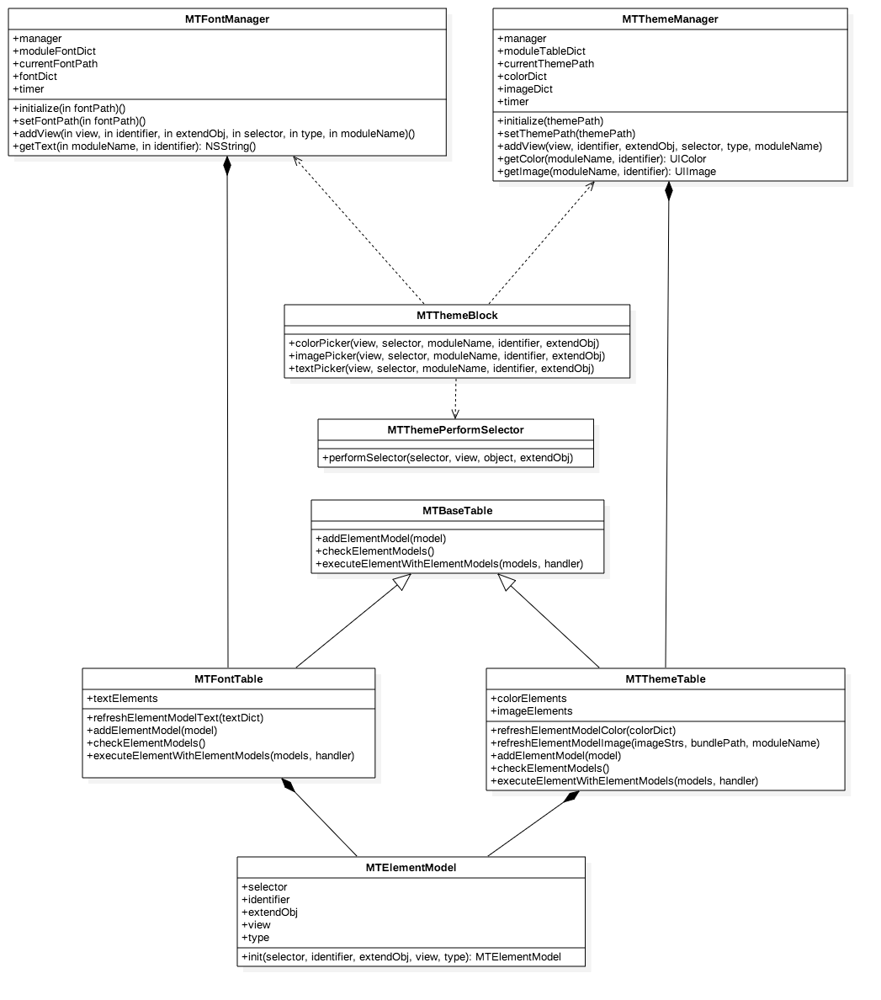

MTTheme
---------
## 简述
### 1.本模块功能

* 通过 `MTThemeManager` 设置主题路径，可以动态的进行主题切换
* 通过 `MTFontManager` 设置文字路径，可以动态的进行文字的切换, 类似国际化

### 2.效果图

## 设计结构
### 1.文件结构

*  `Categorys`文件夹下的类是颜色、图片、内容赋值时所需的分类。
*  `Core` 文件夹下 `Font` 放了字体内容管理类，`Theme` 放了主题内容的管理类

### 2.类图结构

> `MTFontManager` :

* 设置文字路径并解析 `font.plist`
* 通过 `addView:identifier:extendObj:selector:type:moduleName` 注册视图，当字体变化时，重新设置已经注册的视图的字体内容
* 通过 `getTextWithModuleName:identifier:` 获取对应的字体内容

> `MTThemeManager ` :

* 设置主题路径并解析 `color.plist` 和图片列表
* 通过 `addView:identifier:extendObj:selector:type:moduleName` 注册视图，当主题变化时，重新设置已经注册的视图的图片和颜色
* 通过 `getColorWithModuleName:identifier:` 获取对应的颜色值
* 通过 `getImageWithModuleName:identifier:` 获取对应的图片

> `MTFontTable` : 

* 管理 `MTElementModel` 列表，并刷新字体内容列表数据

> `MTThemeTable` : 

* 管理 `MTElementModel` 列表，并刷新图片颜色列表数据

> `MTElementModel` : 

* 存储配置视图时，视图的 `selector`, `identifier`, `extendObj`, `view`, `type`

> `MTBaseTable` :

* `MTThemeTable` `MTFontTable` 的父类

> `MTThemePerformSelector` :

* 通过 `performSelector:view:object:extendObj:` 动态的执行赋值方法

> `MTThemeBlock` :

* 视图的 `Category` 通过此类与管理类交互
* `colorPickerWithView:selector:moduleName:identifier:extendObj:` 视图的color设置
* `imagePickerWithView:selector:moduleName:identifier:extendObj:` 视图的image设置
* `textPickerWithView:selector:moduleName:identifier:extendObj:` 视图的text设置

## 使用方式
## 加载性能评测
## 优化
* 在 `MTThemeManger` 和 `MTFontManager` 添加了定时器，每10秒会对每个模块的 `ElementModels` 中 `view` 为 `nil` 的对象进行清空。
* 每次改变主题时也会对对每个模块的 `ElementModels` 中 `view` 为 `nil` 的对象进行清空

## 后续优化
> 加载主题数据时采用延迟加载，分模块加载

## 结语
您的star，是我前进的动力^_^
